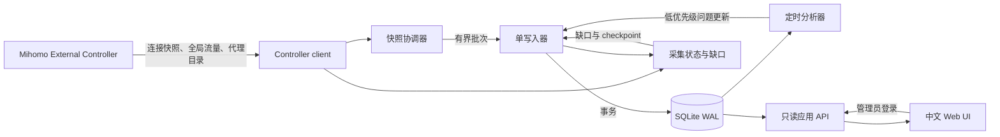

# Phase 1：系统架构设计

状态：需求访谈已确认；本文件定义首版边界，不定义数据库表和 API 字段映射的最终细节。

## 目标与边界

Mihomo Observer 是本仓库 `mihomo-observer/` 内的独立 Go 程序。一个 Observer 只观测一台用户指定的 Linux 或 Windows 桌面 Mihomo 客户端，持续保留已观测连接和汇总数据，帮助用户回顾可能与订阅配置有关的访问异常。Observer 展示证据和检查方向，由用户判断是否需要修改配置。

首版不抓包、不自动改配置、不做主动探测、不持久化 Mihomo 日志，也不把代理节点排成速度榜。完整 MVP 在 Phase 8 的 Web UI 完成后交付；Phase 6 先形成可运行的采集、存储、聚合、分析和只读 API。

## 组件与数据流

| 组件 | 职责 | 边界 |
| --- | --- | --- |
| Controller client | 连接 `/connections` WebSocket 与 `/traffic`，低频读取 `/proxies` 作为代理目录，负责认证、重连和连接状态 | 只访问所需的 Mihomo 读接口；密钥仅留在服务端；代理目录读取失败不停止连接采集 |
| 快照协调器 | 按连接 ID 识别首次出现、持续出现和从快照中消失，计算已观测字节增量 | 不把消失解释为精确结束或失败 |
| 单写入器 | 从有界队列取批次，在 SQLite 事务中保存连接当前状态、每连接小时贡献、全局流量增量、采集状态和问题更新 | 优先处理采集写入；分析器不进入采集热路径 |
| 定时分析器 | 从已提交的聚合数据与保留期内的连接记录产生可解释的问题证据 | 失败可重试，不阻止采集；不生成自动生效的规则 |
| 应用 API 与 Web UI | 读取汇总、问题历史和目标详情，提供单管理员登录 | 默认只监听本机；不暴露 Mihomo 密钥或其控制接口 |

采用一个进程内的模块化结构，避免首版增加消息服务和独立数据库服务。`cmd/` 放入口；`internal/mihomo`、`collector`、`storage`、`analyzer`、`api`、`web`、`model` 分别承载上述职责。`probe` 等主动探测模块待确有需求时再建。Linux/Windows 原生程序与 Docker 镜像运行同一代码和数据库格式。

## 采集事实与准确性边界

Mihomo 的 [`/connections` WebSocket](https://github.com/MetaCubeX/mihomo/blob/Alpha/hub/route/connections.go) 周期性发送**当前活动连接的完整快照**，不是连接生命周期事件。连接记录含 ID、累计上传/下载、开始时间、规则、代理链和元数据；元数据可含 `host`、`sniffHost`、目标 IP、进程等字段，但字段可能缺失，且没有独立的 `dnsHost` 字段。[连接字段](https://github.com/MetaCubeX/mihomo/blob/Alpha/tunnel/statistic/tracker.go)、[元数据字段](https://github.com/MetaCubeX/mihomo/blob/Alpha/constant/metadata.go)

因此，首版的数据含义如下：

- `started_at` 取 API 确实提供的值；`first_seen_at`、`last_seen_at` 是 Observer 实际看见它的时刻。连接消失后的精确结束时间、失败原因和请求耗时均未知。以连接 ID 和 API 开始时间识别持续连接；WebSocket 重连后可继续更新同一条记录，客户端重启或身份不明时启用新的观测世代，避免复用 ID 覆盖旧记录。
- 短于采样间隔的连接可能完全漏采。连接的最终字节数也可能高于最后一次看到的累计值。目标级连接数和流量均标为“已观测”，不能作为全量审计数据。
- 同一连接在连续有效观测之间的字节差额按**后一次观测时刻**归入小时桶；首次看到或采集缺口后重新出现时，已有的累计值只作为新基线，不归入当前小时。原始记录仍保留最近一次累计值。这样不会把 Observer 启动前或缺口内的流量伪装成当前小时流量。
- `/traffic` 用于全局流量趋势与今日流量；它不能提供目标级请求结果。检测计数器重置或连接中断，避免跨重启计算负差额或填补未知时段。[接口注册](https://github.com/MetaCubeX/mihomo/blob/Alpha/hub/route/server.go)
- 采集断线、队列丢样、Observer 停机造成的缺口必须持久化并在界面可见。断线期间从活动列表消失的连接标为“结束状态未知”。

目标标识优先采用 `host`，缺失时采用 `sniffHost`，两者均缺失时采用目标 IP；保存来源与原值，不根据反向 DNS 猜测域名。无目标 IP 时，IP 版本未知。ASN 只使用 Mihomo 实际提供的值，缺失时保留未知。代理路径保留规则、规则载荷和代理链；不推断 API 未提供的组或出口字段。

原始记录采用字段白名单，不持久化完整 metadata JSON。默认保存目标、端口、规则、代理路径和网络统计；源地址、进程名称与路径为可选采集字段。HTTP Body、Cookie、Authorization Header、URL Query 和 TLS Payload 不入库，服务日志也不输出密钥或完整原始响应。

Phase 3 必须用实际客户端的脱敏响应验证这些字段、鉴权方式、采样间隔和重连行为；Phase 2 的 schema 应允许缺失字段和后续迁移。

## 持久化与后台任务

SQLite 使用 WAL、批量事务和有限的连接池。高频写入集中到一个写入器；Web API 使用独立只读连接和有时间限制的查询，优先读取小时/日汇总与问题记录，避免在巨大原始表上执行 Dashboard 查询。数据库访问通过业务所需的窄 `Store` 接口，不让 SQLite SQL 散布在采集和分析代码中。首版只实现 SQLite。

每个已观测连接保留一条持续更新的原始记录。写入器同时更新短期的“每连接小时贡献”，记录连接首次出现、已观测字节增量及目标、IP、ASN、代理路径和地址族维度；原始记录与贡献记录在同一事务中提交，否则仅凭最终连接行无法恢复跨小时的流量分布。聚合器从贡献记录幂等重算小时与日汇总；日连接数直接对连接去重，不能简单累加小时连接数。贡献记录随原始记录清理。Phase 2 的 [Schema 设计](phase-2-schema.md)定义具体表和修正边界。分析器只读取已提交数据，并把问题更新提交给低优先级写入队列；分析失败或积压不阻塞采集。

原始记录默认保留 14 天，小时统计默认保留 180 天，日统计默认永久保留；数值可配置，`0` 表示永久。清理任务小批量删除过期记录，避免长事务影响采集。长期展示依赖聚合数据；原始数据过期后，详情不再声称能列出每条连接。

有界队列和批次大小限制内存使用。队列满、数据库持续不可写或采集连接中断时，不无限积压；记录丢样或缺口，并在恢复后继续。不得将遗漏的数据伪装为零流量。进程重启后根据上次成功持久化时间标记可能的缺口；旧连接不推断为正常结束。

## 分析与界面

首版 Problems 以完整主机名或 IP 为一行，详情按规则、代理链、IP 版本拆分。问题包含证据类型、样本量、时间范围、最近出现时间、采集完整性和建议检查的配置方向。达到可配置的最小样本量才进入 Problems；近期默认指最近 7 天，历史记录继续保留，并区分“近期仍出现”与“近期未再出现”。

首版识别三类迹象：短时重复连接、需要其他迹象佐证的小流量长连接，以及同目标、同规则和代理路径下样本充分的 IPv4/IPv6 差异。它们不等同于请求失败、重试、协议回退或错误分流。历史基线评分、失败率、主动 DIRECT/代理对照与节点速度排名留待有足够数据或主动验证机制时再设计。

Web UI 包含 Dashboard、Problems、目标详情和 Proxy Detail。Dashboard 展示当前已观测连接、今日已观测连接、全局今日流量、问题数量及采集状态；目标详情展示域名/IP、ASN、地址族与路径拆分、时间趋势和问题历史；Proxy Detail 展示路径承载的目标和异常证据，不评选“最佳节点”。所有含缺口的图表应标出缺口，不将其画成零值。首版用中文，文字集中管理以便将来本地化。

## 安全与部署

Observer 与 Mihomo Controller 的密钥分离。Mihomo 密钥仅由服务端读取，不返回浏览器、不写入日志；Observer Web UI 从首版起要求单管理员登录。初始密码经环境变量或配置文件提供，启动时生成安全摘要；未配置时拒绝启动 Web 服务。Web 会话、密码尝试限制和常见跨站请求保护在实现阶段落实。

Web 服务默认监听本机；用户可显式配置监听所有接口。远程访问推荐通过 HTTPS 反向代理或可信私有网络，文档明确普通 HTTP 的传输风险。Docker 部署要求容器能访问指定 Controller，数据目录持久化；FlClash 当前只在回环地址开放 Controller，因此 Windows 首版使用原生 Observer，Docker 用于可达环境（如适当配置的 Linux host network）。Windows/Linux 原生部署使用同一配置模型。每个 Observer 只绑定一个客户端及一份数据库，不在首版引入集中采集。

## 取舍与扩展边界

| 选择 | 理由和代价 | 将来如何扩展 |
| --- | --- | --- |
| Controller 快照，不抓包 | 部署简单、对 Mihomo 干扰低；会漏短连接，缺少失败原因 | 如实际需要完整生命周期，再评估额外数据源，不改变现有数据的“已观测”语义 |
| 单进程、SQLite | 桌面单实例资源占用和运维成本低；不适合多写入者集中部署 | 保持 Store 边界；出现多实例集中采集需求后再设计 PostgreSQL |
| 写入时维护短期每连接小时贡献 | 原始连接只留一行仍可保留跨小时趋势，晚到域名可在保留期内修正；多一张派生表 | 从贡献记录重算新汇总维度，超出原始保留期的统计不承诺可重算 |
| 证据优先，无自动建议规则 | 避免在缺少请求结果和对照测试时误导配置修改；结论较克制 | 被动证据稳定后可增加受限主动探测和有依据的规则草案 |
| 默认本机、可显式远程监听 | 满足桌面使用和 Docker 部署；远程 HTTP 需要使用者保护传输 | 后续可加内置 TLS 或外部身份提供方，不作为首版前提 |

## 后续阶段的交付界限

1. **Phase 2 Schema**：定义连接、采集缺口、全局流量、每连接小时贡献、小时/日汇总和问题历史的表、索引、迁移及保留策略；明确跨小时增量的事务口径。
2. **Phase 3 API 数据模型**：用官方接口与实际客户端脱敏样本核对字段可用性和空值，不存在的字段不进入必填模型。
3. **Phase 4 Collector**：实现快照协调、重连、会话隔离、有界队列、批量写入与数据完整性标记。
4. **Phase 5 Analyzer**：定义三类迹象的门槛、证据和误报控制，并验证缺口与小样本的处理。
5. **Phase 6–8**：依次交付后端可运行版本、Docker 部署和完整 Web UI。
